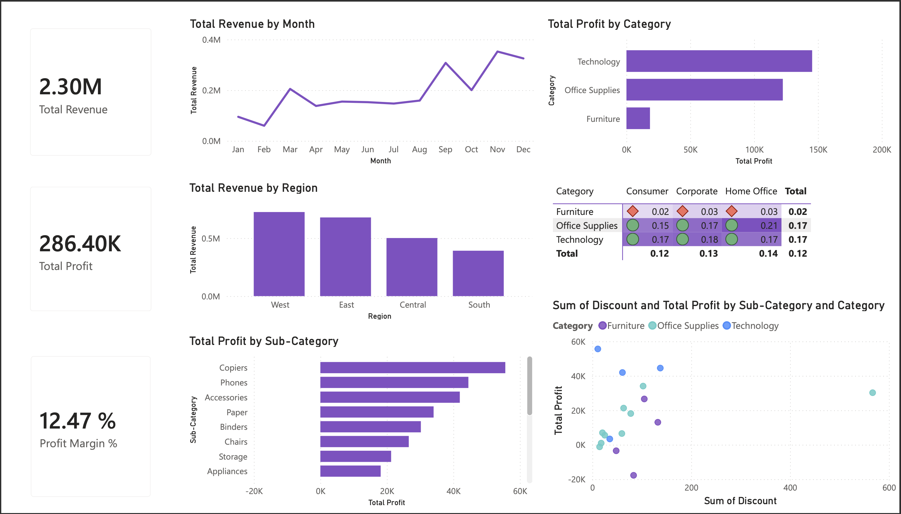
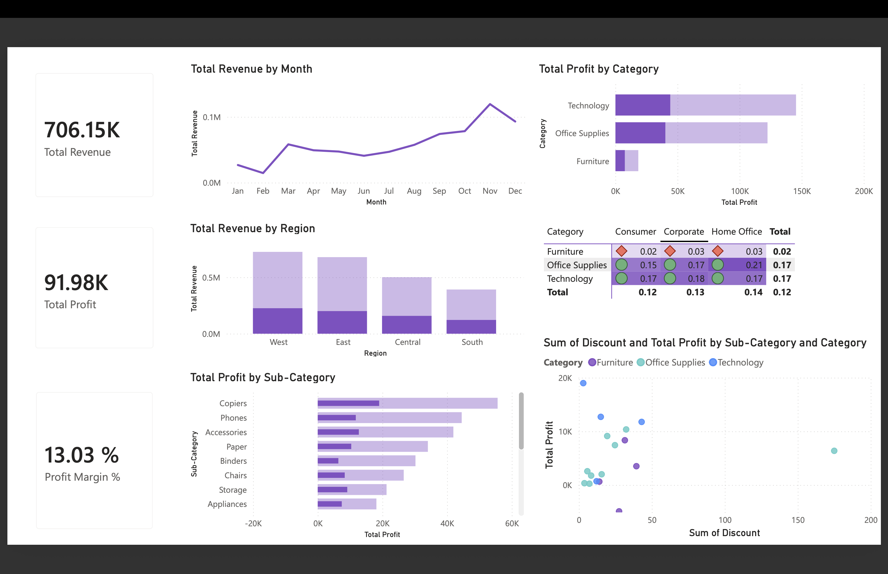

# Finance Performance Dashboard

An interactive Power BI dashboard analyzing company-wide financial performance — revenue, profitability, and margin trends — built on a proper data model with a custom date table, table relationships, and DAX measures.

## Business Problem

A retail business needed a consolidated view of its financial performance to answer key questions for leadership and finance teams:

- What is overall revenue, profit, and profit margin?
- How does revenue trend across the year, and when are peak periods?
- Which product categories and sub-categories are most profitable?
- Which regions generate the most revenue?
- Does discounting actually erode profit?
- How does profitability vary across customer segments?

## Dataset

- **Source:** Sample Superstore dataset (Kaggle)
- **Records:** 9,994 transactions
- **Fields:** Order details, product category/sub-category, sales, profit, discount, customer segment, region, and order date

## Tools Used

- **Power BI Service** (Microsoft Fabric) for data modeling and visualization
- **Power Query** for data import and cleaning
- **DAX** for custom measures and a calculated date table

## Data Model

Unlike a single flat table, this project uses a proper star-schema-style model:

- A **fact table** (Superstore transactions) containing sales, profit, and discount data
- A separate **Date table**, built using `CALENDAR()` in DAX, with Year, Month, and MonthNumber columns
- An **active relationship** linking the fact table's Order Date to the Date table
- **Custom DAX measures**, including:
  - `Total Revenue`
  - `Total Profit`
  - `Profit Margin %` (Profit ÷ Revenue)
  - `Average Order Value`

This structure allows for accurate time-based filtering and aggregation, rather than relying on a single raw date column.

## Dashboard Overview

| Visual | Purpose |
|---|---|
| Total Revenue, Total Profit, Profit Margin % (KPIs) | Headline financial performance |
| Total Revenue by Month | Identifies seasonal revenue trends |
| Total Profit by Category | Compares profitability across product categories |
| Total Revenue by Region | Highlights strongest and weakest performing markets |
| Profit Margin % by Category & Segment (Matrix) | Cross-tab view of profitability by category and customer segment |
| Discount vs Profit (Scatter) | Visualizes the relationship between discounting and profitability |

## Key Insights

1. **Total revenue across the dataset was $2.30M, generating $286.4K in profit** at a 12.47% overall margin.
2. **Revenue shows a strong seasonal pattern**, dipping mid-year before rising sharply toward Q4, with a peak around November.
3. **Technology is the most profitable category**, both in absolute profit and in margin consistency (17-18%) across every customer segment, while **Furniture margins are consistently the weakest (2-3%)** regardless of segment.
4. **The West region generates the highest revenue**, with the South region trailing noticeably behind — suggesting an opportunity to investigate underperformance there.
5. **Higher discounts do not reliably translate into higher profit.** Several heavily discounted orders show disproportionately low or negative profit, suggesting discounting policy may need tighter controls in certain sub-categories.

## Recommendations

- Investigate the consistently low margins in Furniture — whether driven by cost structure, pricing, or heavy discounting — and consider a pricing or sourcing review.
- Examine the South region's underperformance relative to other regions to identify whether it's a demand, pricing, or operational issue.
- Tighten discount thresholds in categories where discounting shows limited or negative correlation with profit.
- Use the strong Q4 seasonal pattern to inform inventory planning and marketing spend timing for the following year.

## Skills Demonstrated

- Relational data modeling (fact table + date dimension table)
- DAX measure creation (aggregations, ratios, calculated tables)
- Data type debugging and relationship troubleshooting
- Multi-visual dashboard design including scatter plots and matrix cross-tabs
- Business insight generation and recommendation writing

## Author

**Shreya Basu Roy**
MSc Business Analytics & Finance, University of Southampton
[LinkedIn](#) · [GitHub](#)
